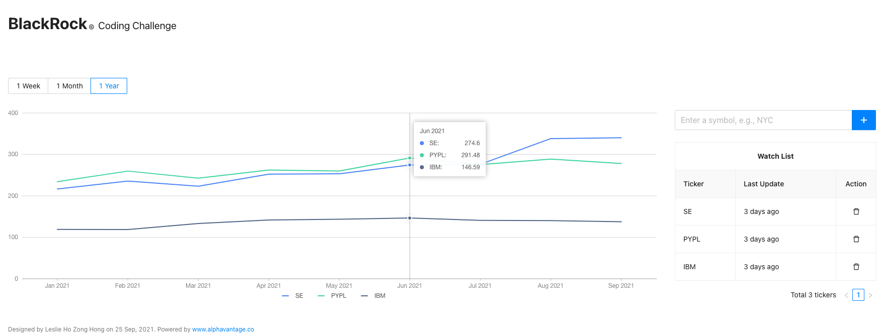

# BlackRock FE Coding Challenge

## Tools used

| Name       | Version |
| ---------- | ------- |
| NodeJs     | 16.3.0  |
| React      | 17.0.2  |
| TypeScript | 4.4.3   |
| Ant Design | 4.16.13 |
| Lodash     | 4.17.21 |
| Dayjs      | 1.10.7  |

## Installation

1. Open the project in a editor and navigate to the project root directory
2. Run `npm update` to install node modules
3. Run `npm start` to preview application on http://localhost:3000/

## Important

This application rely on [Alpha Vantage API](https://www.alphavantage.co/documentation/) to fetch real time financial data (see [www.alphavantage.co/support](https://www.alphavantage.co/support/#support)). Public usage is capped at **5 calls per minute and 500 calls per day**. Should you encounter the error - _Alpha Vantage API call frequency is limit to 5 calls per minute & 500 calls per day_, please few for a few minutes before trying again. Should you run out of quota, feel free to replace the existing `API_KEY` in `src/App.tsx` For more information about the API, please check out https://www.alphavantage.co/documentation/
